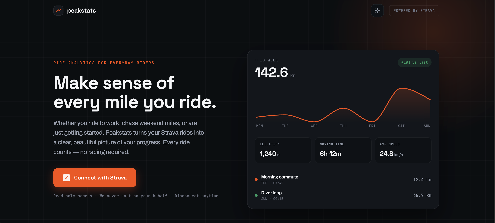
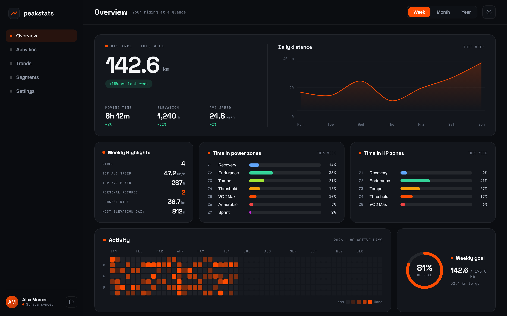
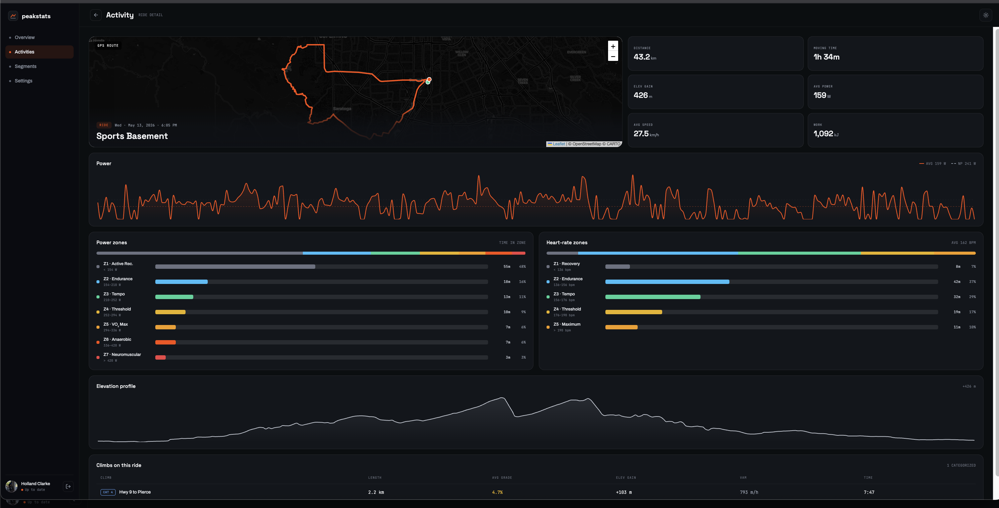
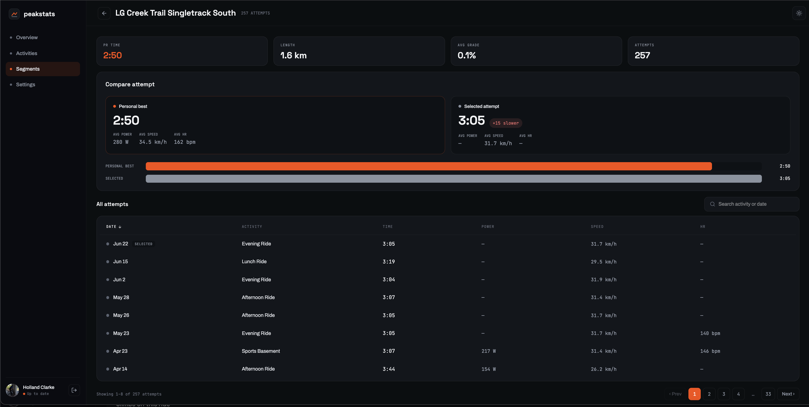

<div align="center">


# PeakStats

**Ride analytics for everyday riders — a richer view of your Strava history.**

Sign in with Strava, sync your rides, and explore a clean analytics surface:
weekly KPIs with period-over-period deltas, a filterable activity table,
full ride detail (route, elevation, power, zones, climbs), and segment PRs.

[**Live app → peakstats.vercel.app**](https://peakstats.vercel.app)


</div>

<p align="center">
  
</p>

---

## What it is

PeakStats is a real, deployed product built around a single idea: **Strava already
has your data — PeakStats makes it legible.** It connects through Strava OAuth (the
sole identity), pulls your activity history into its own store, and renders an
analytics experience aimed at riders who care about progress, not just racing.

The Strava client secret and access tokens **never touch the browser** — all token
exchange and refresh happen server-side, and every database read is scoped to the
owning athlete via Postgres row-level security.

## Highlights

- **Sign in with Strava** — OAuth 2.0 with `read,activity:read_all`, server-side
  token storage and automatic hourly refresh. The SPA never sees a Strava secret.
- **Automatic sync** — an initial backfill worker pages through your full history
  with live progress, then new rides land automatically via **Strava webhooks**
  (plus a manual "refresh" button).
- **Overview dashboard** — weekly distance, moving time, elevation, and average
  speed, each with a period-over-period delta, a daily-distance trend chart, and
  your most recent rides.
- **Activities table** — search plus distance / time / elevation filters, sortable
  columns, and stable snapshot pagination.
- **Ride detail** — a pannable, zoomable Leaflet route map, elevation and power
  charts, time-in-zone breakdowns (power + heart rate), and detected climbs.
- **Segments** — derived from detailed activity payloads (not the Strava segment
  API), with attempt counts, PR tracking, and an effort-comparison detail view.
- **Settings** — metric/imperial units, light/dark theme, default period, and
  one-click disconnect — all persisted to your athlete profile.

## Screens

> The landing page, ride detail, and segment detail are live captures of the app;
> the overview image is rendered from the project's design source with representative
> sample data. The live app implements the core of each of these screens.

### Overview


### Ride detail


### Segment detail


## Architecture

```
Browser — Vite + React SPA (Vercel)
   │   auth: redirect to Strava OAuth · session via first-party cookie
   │   data: HTTPS JSON  ───────────────►  FastAPI (Render)
   │                                          ├─ OAuth code → token exchange (client secret)
   │                                          ├─ token refresh (hourly expiry)
   │                                          ├─ backfill worker + webhook ingest
   │                                          └─ stats / aggregation endpoints
   │                                          ▼
   │                                       Supabase Postgres (+ RLS)
   │
Strava  ──webhook POST──►  FastAPI /webhooks/strava
```

A few decisions worth calling out:

- **Secrets stay on the server.** The Strava client secret and Supabase service-role
  key live only on Render. The browser gets the API base URL and the Supabase anon
  key — nothing more.
- **First-party session cookie.** The frontend reaches the API through a Vercel
  rewrite/proxy so the `ps_session` cookie is first-party, sidestepping third-party
  cookie restrictions.
- **Row-level security everywhere.** Supabase RLS scopes every read to the
  authenticated athlete; tokens are stored in a table the client can never read.
- **Layered, enforced backend.** `routers → services → db`, with no layer skipping
  another — and a `test_architecture.py` guard test that statically parses `app/` to
  keep it that way. Services hold all business logic and import no FastAPI.
- **Segments are derived, not fetched.** Detailed activity payloads carry a
  `segment_efforts` array; the backend upserts segments/efforts from those and
  computes each athlete's PR — no extra Strava segment calls against the rate limit.
- **Metric in, converted at the edge.** Data is stored Strava-native (metric); unit
  conversion (km/mi, m/ft, km/h/mph) happens client-side at render time.
- **Aggregation in Postgres.** Segment list stats are computed by a Postgres
  aggregation function rather than in app code, cutting that list from seconds to
  sub-second.

## Tech stack

| Layer | Stack |
|---|---|
| **Frontend** | Vite · React 19  · Tailwind CSS v4 |
| **Backend** | Python 3.12 · FastAPI |
| **Data / Auth** | Supabase Postgres + Row-Level Security · Strava OAuth 2.0 |
| **Hosting** | Vercel (SPA) · Render (API) · Supabase |
| **Testing** | pytest · Vitest + React Testing Library |

## License

[MIT](LICENSE) © 2026 Holland Clarke

<br>

<div align="center"><sub>Powered by the Strava API. Not affiliated with Strava.</sub></div>
